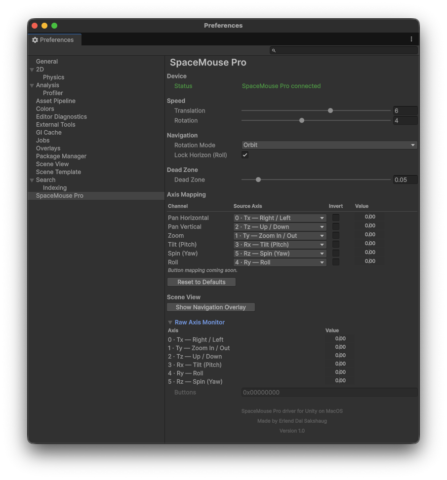
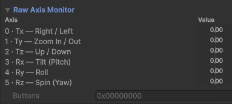
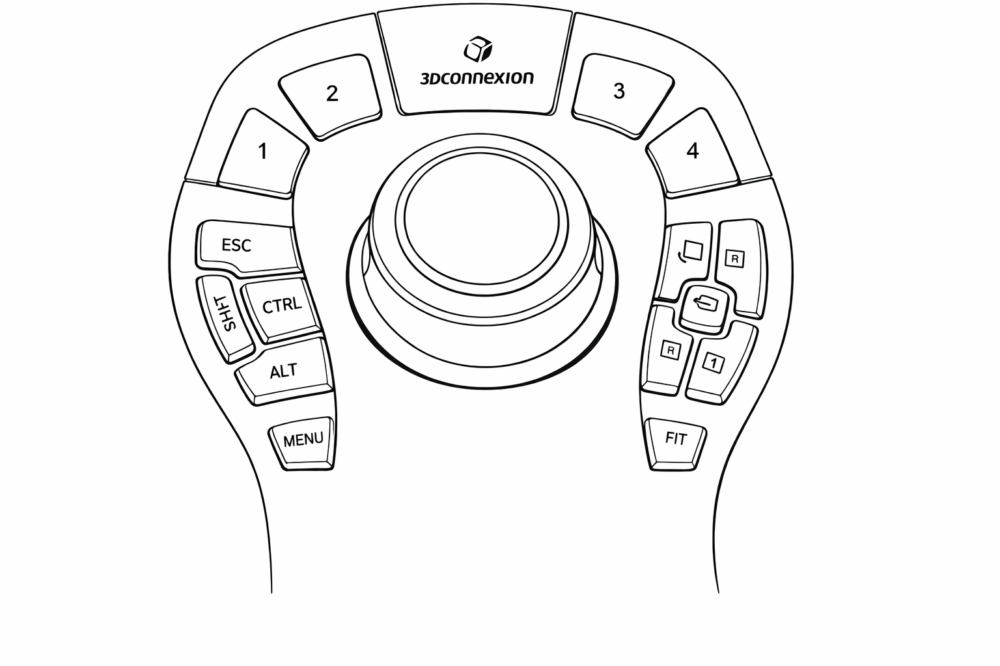
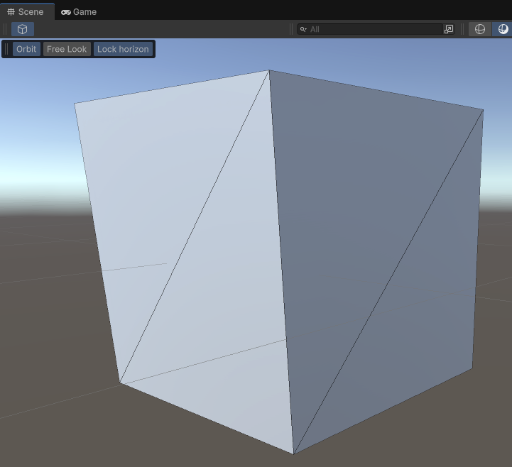

# SpaceMouse Pro Driver for Unity on macOS

A Unity Editor plugin that brings full 6DOF SpaceMouse Pro navigation to the Unity Scene View on macOS. Supports orbit and free-look camera modes, per-axis remapping, fully customisable button mapping, speed controls, and a live Scene View overlay.

---

## Requirements

- **macOS** (Apple Silicon or Intel) — tested on macOS 26 Tahoe
- **Unity** — tested on 6000.3
- **3DxWareMac** driver installed — [download from 3Dconnexion](https://3dconnexion.com/us/drivers/)
  The driver must be running for the plugin to receive device input.
- A **SpaceMouse Pro** — if you get this working on other 3Dconnexion devices, please let me know!

---

## Installation

### Via Unity Package Manager (recommended)

1. Open **Window → Package Manager**
2. Click the **+** button → **Add package from git URL**
3. Enter:
   ```
   https://github.com/figgy78/Spacemouse-pro-for-unity-on-macos.git#upm
   ```
4. Click **Add**

> **macOS Security:** If macOS blocks the dylib after install, go to **System Settings → Privacy & Security** and allow it.

### Manual installation

1. Download or clone this repository.
2. Copy the following folders into your Unity project's `Assets` folder:
   ```
   Assets/Plugins/
   Assets/SpaceMousePro/
   ```
   Your project's `Assets` folder should end up containing both `Plugins/` and `SpaceMousePro/`.

3. Open Unity. In the **Project** window, select:
   ```
   Assets/Plugins/macOS/libSpaceMouseBridge.dylib
   ```
   In the **Inspector**, confirm:
   - **Platform** is set to **Editor only**
   - **CPU** is **ARM64** (Apple Silicon) or **Any CPU**

4. Reopen or reload the project. On load you should see a console message:
   ```
   [SpaceMouse] Initialized. Device connected.
   ```

> **macOS Security:** If macOS blocks the dylib, go to **System Settings → Privacy & Security** and allow it.

---

## Settings



Open **Edit → Preferences → SpaceMouse Pro**.

| Section | Description |
|---|---|
| **Device** | Driver and connection status; button to show the Scene View overlay |
| **Speed** | Translation (0–10) and Rotation (0–10) speed multipliers |
| **Navigation** | Switch between Orbit and Free Look; toggle Lock Horizon (Roll) |
| **Dead Zone** | Minimum axis threshold before input registers |
| **Axis Mapping** | Remap each output channel to any raw device axis; invert per-channel |
| **Button Mapping** | Assign any command to each SpaceMouse button |
| **Raw Axis Monitor** | Live readout of all 6 raw axes and button bitmask (expandable, device must be connected) |



Use **Export Settings / Import Settings** to save and restore your configuration, and **Reset to Defaults** to restore all settings to factory values.

---

## Button Mapping



Each SpaceMouse button can be assigned any of four command types, chosen via the **…** picker:

| Type | Examples | How it works |
|---|---|---|
| **SpaceMouse Built-in** | Top View, Frame Selected, Rotation Toggle, Toggle Orthographic | Direct SceneView API — no key binding required |
| **Modifier Keys** | Shift, Ctrl, Cmd, Option, Esc | Simulates a system key press via macOS CGEvent. Modifier keys (Shift, Ctrl, etc.) are *held* for as long as the button is held. Esc fires as a tap. |
| **Unity Menus** | Edit/Undo, Edit/Redo, Window/General/Console | Executes any Unity main menu item directly |
| **Other Shortcuts** | 3D Viewport/Frame All, Scene View/Toggle 2D Mode | Looks up the shortcut's key binding in Unity's Shortcut Manager and simulates it via CGEvent. Requires the shortcut to have a key binding assigned. |

Click **Clear** to remove a mapping from a button.

### Default button mapping

| Button | Default action |
|---|---|
| App Key 1 | Edit / Undo |
| App Key 2 | Edit / Redo |
| App Key 3 | Toggle Orthographic |
| App Key 4 | Scene View / Toggle 2D Mode |
| Esc | Escape key |
| Shift | Shift key (held) |
| Ctrl | Control key (held) |
| Alt | Option key (held) |
| Roll +90° | Roll view +90° |
| Top | Top View |
| Rotation Toggle | Toggle rotation lock |
| Front | Front View |
| Right | Right View |
| Menu | Edit / Project Settings |
| Fit | Frame Selected |

---

## Scene View Overlay



The overlay adds compact navigation controls directly to the Scene View toolbar.

**To enable the overlay:**

1. Open a **Scene View** window.
2. Either:
   - Click **Show Navigation Overlay** in **Preferences → SpaceMouse Pro → Device**, or
   - Click the **☰ (overlay menu)** icon in the top-right of the Scene View and enable **SpaceMouse**.

The overlay shows three toggle buttons:

| Button | Action |
|---|---|
| **Orbit** | Camera orbits around a fixed pivot point |
| **Free Look** | First-person camera — rotates in place, no pivot |
| **Lock horizon** | Suppresses roll so the horizon stays level |

---

## How to Use

### Navigation Modes

**Orbit** (default)
The camera moves on a sphere around the current pivot point. Rotation always faces the pivot. Pan slides the pivot; zoom changes the orbit radius.

**Free Look**
First-person mode. The camera rotates around its own position and translates freely through space. No pivot point.

Switch modes from the Scene View overlay or from **Preferences → SpaceMouse Pro → Navigation → Rotation Mode**.

### Lock Horizon

Enable **Lock Horizon (Roll)** to prevent the camera from rolling. The roll axis mapping remains configured but its output is suppressed. Disable it to allow free roll.

### Rotation Lock

Assign **Rotation Toggle** (SpaceMouse Built-in) to any button to toggle all rotational input on and off at runtime. Translation (pan and zoom) continues to work while rotation is locked.

### Axis Mapping

Each of the 6 output channels (Pan Horizontal, Pan Vertical, Zoom, Tilt, Spin, Roll) can be freely mapped to any raw device axis. Set a channel's source to **— None —** to disable it entirely. Each channel can also be individually inverted.

---

## Building the Native Plugin (optional)

The compiled `libSpaceMouseBridge.dylib` is included and ready to use. If you want to rebuild it from source:

```bash
cd NativePlugin
bash build.sh
```

Requires Xcode command-line tools and the 3DxWareMac driver installed at `/Library/Frameworks/3DconnexionClient.framework`.

---

## Copyright & Disclaimer

This plugin communicates with the **3DconnexionClient.framework**, which is proprietary software developed and distributed by **3Dconnexion**. The SpaceMouse Pro hardware and all associated drivers are products of 3Dconnexion.

This project is an **independent, open-source integration** and is **not affiliated with, endorsed by, or supported by 3Dconnexion**. No 3Dconnexion proprietary code or SDK files are distributed with this plugin — only the public framework API is used at runtime.

---

## Credits

Made by **Erlend Dal Sakshaug**

Contributions and feedback welcome — open an issue or pull request on GitHub.
